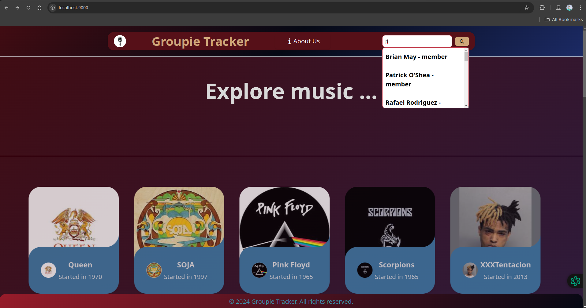

# Groupie Trackers Search Bar

## Description

`search-bar` is a project based off groupie tracker that involves receiving a given API and manipulating the data contained in it to create a website that displays the information. The API consists of four parts:

1. **Artists**: Information about bands and artists, including their names, images, the year they began their activity, the date of their first album, and their members.
2. **Locations**: Details of their last and/or upcoming concert locations.
3. **Dates**: Information about their last and/or upcoming concert dates.
4. **Relation**: Links between artists, dates, and locations.

This program is primarily written in Go for server-side logic, utilizing HTML templates and CSS stylesheets to visually enhance the website and provide a user-friendly interface.

`Groupie tracker` is a web application that displays information about bands, their members, concert performance locations and their respective dates. It reads information from a provided `API(application programming interface)` which basically gets requests from end users and provide feedback by reading from the database on a web server, and displaying the information on a web user-interface.

## Prerequisites

To build and run this project, the requirements include:

### Go installation

- A machine configured to run Go and its related packages is the basic requirement of this program. You can install Go following through the instructions as directed in the official [Go installation pages](https://golang.org/)

## Usage: How To Run

### Clone the repository

- To get access to the program, you need to clone the repository from Gitea.

```bash
    git clone https://learn.zone01kisumu.ke/git/jamos/groupie-trackersearchbar.git
```

### Switch to the main directory

- Switch to the directory containing the main.go file.

```bash
    cd groupie-tracker-search-bar/
```

### Running the project

- Open the terminal and run the following command:

```bash
    go run . [PORT]
```

PS Specify the port you prefer to use.
For example:

```bash
    go run . 9000
```

Once the server starts, oprn your web browser and navigate to `http://localhost:[PORT]`. This will direct you to the index page of this program.



- You can manoeuvre through our pages by clicking the links embedded in the navigation bar to gain access to them.

## Authors

This program is authored by:

- [John Paul](https://learn.zone01kisumu.ke/git/johnotieno0)
- [Cynthia Oketch](https://learn.zone01kisumu.ke/git/coketch)
- [Joel Amos](https://learn.zone01kisumu.ke/git/jamos)

## Contributions

- All contributions are welcome! If you find any issues within the working of the program, or have any suggestions for improvements, please open an issue or submit a pull request.

### Steps on how to open a PR

    - Fork the repository
    - Create your feature branch (git checkout -b feature-name)
    - Commit your changes (git commit -am 'Add feature')
    - Push to the branch (git push origin feature-name)
    - Open a pull request

## License

This project is licensed under the MIT - see the [LICENSE](https://learn.zone01kisumu.ke/git/coketch/groupie-tracker/src/branch/master/LICENSE) for details.
